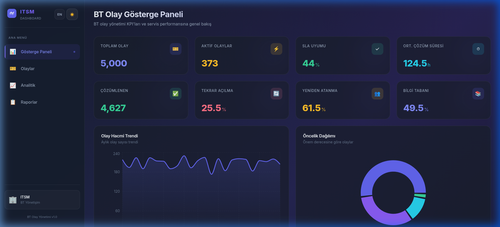
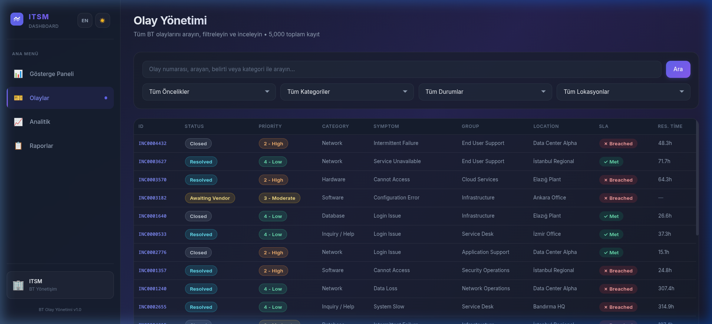
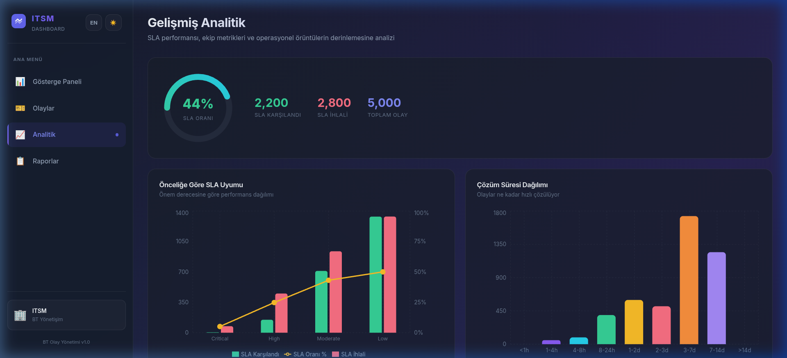
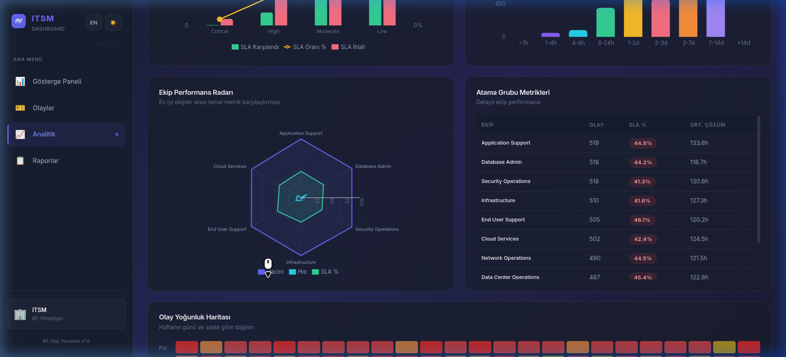
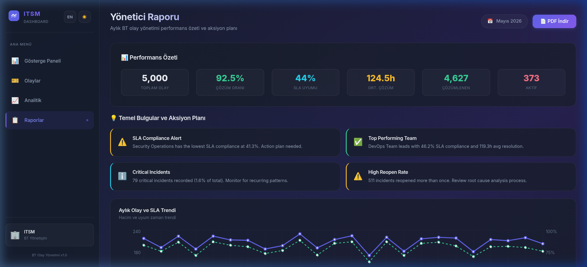

<div align="center">

# 🖥️ IT Incident Management Dashboard

**A full-stack ITSM analytics dashboard built with React & Flask — featuring real-time KPI monitoring, SLA tracking, interactive analytics, and professional PDF reporting.**

[](https://react.dev)
[](https://flask.palletsprojects.com)
[](https://recharts.org)

<br>



</div>

---

## ✨ Features

| Feature | Description |
|---------|-------------|
| 📊 **KPI Dashboard** | Real-time metrics — total incidents, SLA compliance, resolution time, reopen & reassignment rates |
| 🎫 **Incident Browser** | Paginated, searchable, multi-filter table with sortable columns and status badges |
| 📈 **Advanced Analytics** | SLA donut charts, team performance radar, incident volume heatmap, resolution distribution |
| 📋 **Executive Reports** | Auto-generated insights, monthly trend comparisons, team rankings |
| 📄 **PDF Export** | Professional corporate-style PDF reports with KPI tables, bar charts, and confidentiality headers |
| 🌓 **Dark / Light Mode** | Full theme switching with glassmorphism design system |
| 🌐 **i18n (TR / EN)** | Turkish and English language support — Turkish by default |

---

## 📸 Screenshots

<details>
<summary><b>🎫 Incident Management</b></summary>
<br>



Paginated table with search, priority/category/status/location filters, and sortable columns.
</details>

<details>
<summary><b>📈 Advanced Analytics</b></summary>
<br>



SLA compliance by priority, resolution time distribution, team performance radar chart.



Incident volume heatmap (day × hour) with green-yellow-red gradient scale.
</details>

<details>
<summary><b>📋 Executive Reports & PDF</b></summary>
<br>



Auto-generated executive summary with insights, monthly trends, team rankings, and **one-click PDF export** producing a professional 2-page corporate report.
</details>

---

## 🏗️ Architecture

```
┌─────────────────────────────────────────────────┐
│                   Frontend                       │
│   React 18 + Recharts + Glassmorphism CSS        │
│   Dark/Light Theme · TR/EN i18n · jsPDF Export   │
├─────────────────────────────────────────────────┤
│                  REST API                        │
│              Flask + Pandas                      │
│   /api/summary · /api/incidents · /api/trends    │
│   /api/analytics · /api/reports                  │
├─────────────────────────────────────────────────┤
│                    Data                          │
│   5,000 simulated IT incident records (CSV)      │
│   Based on Kaggle IT Incident Log Dataset        │
└─────────────────────────────────────────────────┘
```

## 🛠️ Tech Stack

| Layer | Technology |
|-------|-----------|
| **Frontend** | React 18, Vite, Recharts, jsPDF |
| **Backend** | Python 3, Flask, Pandas, Flask-CORS |
| **Styling** | Vanilla CSS with CSS Custom Properties (dark/light themes) |
| **Data** | 5,000 synthetic incidents generated via `generate_data.py` |

---

## 🚀 Quick Start

### Prerequisites

- **Node.js** 18+ and npm
- **Python** 3.9+

### 1. Clone the repository

```bash
git clone https://github.com/emirkoyunoglu/itsm-dashboard.git
cd itsm-dashboard
```

### 2. Backend setup

```bash
cd backend
pip install flask flask-cors pandas
python generate_data.py      # Generate 5,000 incident records
python app.py                # Starts on http://localhost:5000
```

### 3. Frontend setup

```bash
cd frontend
npm install
npm run dev                  # Starts on http://localhost:5173
```

### 4. Open the dashboard

Navigate to **http://localhost:5173** in your browser.

---

## 📡 API Endpoints

| Method | Endpoint | Description |
|--------|----------|-------------|
| `GET` | `/api/summary` | KPI summary metrics |
| `GET` | `/api/incidents?page=1&per_page=20&search=...` | Paginated, filterable incident list |
| `GET` | `/api/trends?granularity=monthly` | Volume, SLA, and resolution trends |
| `GET` | `/api/priority-distribution` | Priority breakdown with SLA rates |
| `GET` | `/api/category-analysis` | Category and subcategory analysis |
| `GET` | `/api/sla-performance` | SLA by priority, group, and location |
| `GET` | `/api/assignment-groups` | Team performance metrics |
| `GET` | `/api/resolution-analysis` | Resolution time histogram, close codes |
| `GET` | `/api/heatmap` | Hour × day incident volume heatmap |
| `GET` | `/api/filters` | Available filter options |
| `GET` | `/api/reports/executive-summary` | Executive report data |

---

## 📂 Project Structure

```
├── backend/
│   ├── app.py                 # Flask API server
│   ├── generate_data.py       # Synthetic data generator
│   └── data/
│       └── incident_event_log.csv
├── frontend/
│   ├── src/
│   │   ├── main.jsx           # App entry point
│   │   ├── App.jsx            # Router & layout
│   │   ├── ThemeContext.jsx    # Dark/light theme provider
│   │   ├── I18nContext.jsx     # TR/EN internationalization
│   │   ├── index.css           # Design system & CSS variables
│   │   ├── components/
│   │   │   ├── Sidebar.jsx    # Navigation + theme/lang toggles
│   │   │   ├── KPICard.jsx    # Animated KPI metric cards
│   │   │   ├── ChartCard.jsx  # Reusable chart wrapper
│   │   │   └── DataTable.jsx  # Sortable, paginated data table
│   │   └── pages/
│   │       ├── Dashboard.jsx  # Main KPI overview
│   │       ├── Incidents.jsx  # Incident browser & filters
│   │       ├── Analytics.jsx  # Deep-dive analytics
│   │       └── Reports.jsx    # Executive reports + PDF export
│   └── index.html
├── docs/screenshots/          # README screenshots
└── README.md
```

---

## 🎨 Design Highlights

- **Glassmorphism** cards with `backdrop-filter: blur(20px)` and subtle borders
- **Ambient glow** background animation using radial gradients
- **CSS Custom Properties** powering seamless dark ↔ light theme transitions
- **Micro-animations**: count-up KPIs, fade-in stagger, heatmap cell hover zoom
- **Professional PDF**: jsPDF-generated 2-page corporate report with header bands, accent bars, data tables, and page footers

---

## 📊 Data Source

Incident records are synthetically generated using `generate_data.py` (5,000 records). Data structure inspired by the [Kaggle IT Incident Log Dataset](https://www.kaggle.com/datasets/shamiulislamshifat/it-incident-log-dataset).

---

<div align="center">
<sub>Built with ❤️ using React, Flask & Recharts</sub>
</div>
